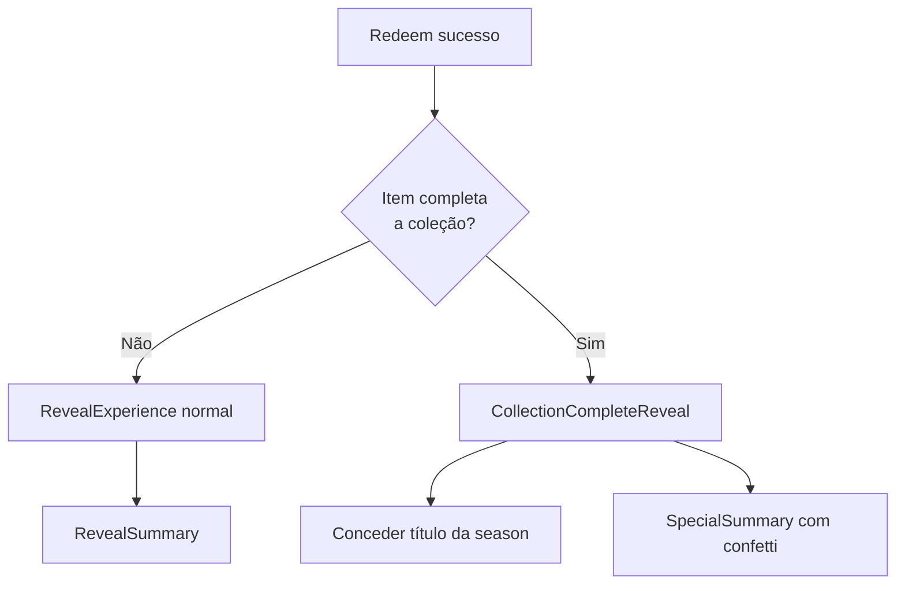

# Sistema de Coleção Completa, Social e Inventário Satisfatório

## Contexto do Projeto

Plataforma phygital Projeto Gênesis: usuários resgatam códigos físicos para obter criaturas digitais. Stack: Next.js 15, Supabase (Postgres + Auth), Tailwind, React Three Fiber. Estilo: Biopunk Industrial, Caos Estético.

**Arquivos-chave existentes:**

- Schema: [supabase/migrations/0001_redemption_engine.sql](supabase/migrations/0001_redemption_engine.sql) - `profiles`, `collectibles_catalog`, `user_inventory`, `redemption_codes`
- Seasons: [supabase/data/season01.json](supabase/data/season01.json) - 5 criaturas por raridade com `series: "galaxy-aurum"`
- Inventário atual: [src/features/inventory/components/InventoryGrid.tsx](src/features/inventory/components/InventoryGrid.tsx) - grid básico
- Reveal: [src/features/gacha/components/reveal/RevealExperience.tsx](src/features/gacha/components/reveal/RevealExperience.tsx) - fluxo de revelação

---

## 1. Cena Especial ao Completar Coleção da Season

**Requisito:** Quando o item revelado for o **último faltando** para completar a coleção da season, exibir uma cena própria (diferente da revelação normal).

### Fluxo




### Implementação

- **RPC/SQL:** Modificar `redeem_code` ou criar função auxiliar `is_collection_complete_after_redeem(p_user_id uuid, p_collectible_id uuid)` que retorna `(is_complete boolean, season_id text)`.
- **Lógica:** Uma season = conjunto de `collectibles_catalog` com mesmo `series`. Coleção completa = usuário possui ao menos 1 de cada slug único da season.
- **Server Action:** O `redeemAction` precisa retornar `{ ...item, isCollectionComplete?: boolean, seasonId?: string }`. Buscar isso após o RPC (consulta adicional ou RPC estendido).
- **Componente:** `CollectionCompleteReveal.tsx` - cena celebratória (confetti, luzes, texto "Coleção Completa!", som épico). Reutiliza estrutura do RevealExperience mas com animações distintas.
- **Integração:** Em `RedeemForm`, após `status === "success"`: se `item.isCollectionComplete`, renderizar `CollectionCompleteReveal` em vez de `RevealExperience`.

---

## 2. Títulos no Perfil (por completar coleção)

**Requisito:** Ao preencher a coleção inteira de uma season, ganhar um título que pode ser exibido no perfil.

### Schema (nova migração)

```sql
-- Tabela de títulos (desbloqueáveis)
create table titles (
  id uuid primary key default gen_random_uuid(),
  slug text not null unique,
  name text not null,
  description text,
  season_id text not null,
  requirement text not null default 'collection_complete'
);

-- Títulos desbloqueados por usuário
create table user_titles (
  user_id uuid references auth.users(id) on delete cascade,
  title_id uuid references titles(id) on delete cascade,
  unlocked_at timestamptz default now(),
  primary key (user_id, title_id)
);

-- Título selecionado no perfil
alter table profiles add column selected_title_id uuid references titles(id);
```

- Seed: inserir título para `season01` (ex: "Mestre da Galáxia Aurum").
- **RPC:** `award_title_on_collection_complete(p_user_id uuid, p_season_id text)` - insere em `user_titles` e opcionalmente define `profiles.selected_title_id`.
- **UI:** `UserMenu` e página de perfil exibem o título selecionado. Página `/perfil` ou `/profile` para escolher título entre os desbloqueados.

---

## 3. Sistema de Amigos e Ver Coleção de Amigos

**Requisito:** Adicionar amigos e ver a coleção deles.

### Schema

```sql
create table friend_requests (
  id uuid primary key default gen_random_uuid(),
  sender_id uuid not null references auth.users(id) on delete cascade,
  receiver_id uuid not null references auth.users(id) on delete cascade,
  status text not null default 'pending', -- pending, accepted, rejected
  created_at timestamptz default now(),
  unique(sender_id, receiver_id)
);

create table friendships (
  user_a uuid not null references auth.users(id) on delete cascade,
  user_b uuid not null references auth.users(id) on delete cascade,
  created_at timestamptz default now(),
  primary key (user_a, user_b),
  check (user_a < user_b)
);
```

- **RLS:** `profiles` deve permitir `select` para usuários autenticados (para buscar amigos por display_name/email). Ou tabela `public_profiles` com dados mínimos.
- **RPCs:** `send_friend_request`, `accept_friend_request`, `reject_friend_request`, `list_friends`, `list_friend_requests`.
- **Páginas:**
  - `/amigos` - lista de amigos, solicitações pendentes, buscar usuário (por email ou username).
  - `/amigos/[id]` ou `/perfil/[id]` - visualizar coleção do amigo (apenas se forem amigos).

### Visualização de coleção do amigo

- Reutilizar `InventoryGrid` mas com dados do amigo. Query: `user_inventory` onde `user_id = friend_id`, com join em `collectibles_catalog`.
- Mostrar progresso da season (ex: 4/5 completos) sem revelar itens futuros.

---

## 4. Inventário Satisfatório

**Requisito:** Tornar o inventário prazeroso de usar.

### Melhorias


| Área                     | Implementação                                                                                                       |
| ------------------------ | ------------------------------------------------------------------------------------------------------------------- |
| **Progresso da coleção** | Barra de progresso por season (ex: "Season 01: 4/5 criaturas"). Slots vazios para itens faltando (silhueta).        |
| **Organização**          | Agrupar por raridade; filtros (raridade, season); ordenação (recente, raridade, nome).                              |
| **Visual**               | Cards com gradiente por raridade, ícone/placeholder 3D leve, animação de hover, badge de "novo" nos últimos 7 dias. |
| **Estatísticas**         | Total de itens, duplicatas, % da coleção, raridade mais comum.                                                      |
| **Interações**           | Clique no card abre modal com detalhes; botão "Dissolver" (ver item 5).                                             |
| **Empty state**          | Ilustração ou animação suave, CTA claro para resgatar.                                                              |


### Arquivos a criar/modificar

- `src/features/inventory/components/CollectionProgress.tsx` - barra + slots da season.
- `src/features/inventory/components/InventoryCard.tsx` - card enriquecido com animações.
- `src/features/inventory/components/InventoryFilters.tsx` - filtros e ordenação.
- `src/app/inventory/page.tsx` - buscar dados de seasons e progresso; layout com sidebar ou tabs.
- Server actions ou RPC para `get_collection_progress(user_id)` retornando `{ seasonId, total, owned, slugs[] }`.

---

## 5. Dissolução de Cartas por Valor (Raridade)

**Requisito:** Dissolver cartas e receber um valor; cada raridade tem um multiplicador em %.

### Tabela de valores (referência)


| Raridade  | Valor base (exemplo) | %     |
| --------- | -------------------- | ----- |
| common    | 10                   | 100%  |
| uncommon  | 20                   | 200%  |
| rare      | 50                   | 500%  |
| epic      | 150                  | 1500% |
| legendary | 500                  | 5000% |


### Schema

```sql
create table user_dust (
  user_id uuid primary key references auth.users(id) on delete cascade,
  amount int not null default 0 check (amount >= 0)
);

-- Constante em app ou tabela rarity_values
-- common: 1, uncommon: 2, rare: 5, epic: 15, legendary: 50
```

### Implementação

- **RPC:** `dissolve_card(p_inventory_id uuid)`:
  - Verificar `user_inventory` pertence ao usuário autenticado.
  - Obter `collectible_id` e `rarity` do item.
  - Calcular valor (ex: `get_rarity_value(rarity)`).
  - `INSERT INTO user_dust ... ON CONFLICT (user_id) DO UPDATE SET amount = user_dust.amount + value`.
  - `DELETE FROM user_inventory WHERE id = p_inventory_id`.
  - Retornar `{ success, dust_earned }`.
- **UI:**
  - No card do inventário: botão "Dissolver" (ou ícone de reciclar).
  - Modal de confirmação: "Dissolver [Nome]? Você receberá X de pó."
  - Exibir saldo de pó no header ou inventário.
- **Constantes:** `src/features/inventory/constants/dissolveValues.ts` - `RARITY_DUST_VALUE`.

---

## 6. Prompt para o Cursor (Resumo Executável)

Use o seguinte texto como prompt para o Cursor implementar:

---

**PROMPT CURSOR - Projeto Gênesis: Coleção, Social e Inventário**

Implemente as seguintes funcionalidades na plataforma Projeto Gênesis (Next.js 15, Supabase, Tailwind):

1. **Cena especial ao completar coleção:** Quando o item resgatado for o último faltando para completar a season, mostrar `CollectionCompleteReveal` (celebração, confetti, som épico) em vez da revelação normal. Extenda o `redeem_code` ou crie consulta para retornar `isCollectionComplete` e `seasonId`. Integre em `RedeemForm`.
2. **Títulos no perfil:** Ao completar coleção, conceder título. Criar tabelas `titles`, `user_titles` e coluna `profiles.selected_title_id`. RPC `award_title_on_collection_complete`. Página `/perfil` para ver/alterar título. Exibir no `UserMenu`.
3. **Sistema de amigos:** Tabelas `friend_requests` e `friendships`. RPCs para enviar/aceitar/rejeitar e listar amigos. Página `/amigos` e `/amigos/[id]` para ver coleção do amigo. RLS para perfis acessíveis entre amigos.
4. **Inventário satisfatório:** Barra de progresso da season, slots vazios para faltantes, cards ricos (gradiente por raridade, hover), filtros por raridade/ordenação, estatísticas (total, duplicatas, %). Componentes `CollectionProgress`, `InventoryCard`, `InventoryFilters`.
5. **Dissolução de cartas:** Tabela `user_dust`. RPC `dissolve_card` que deleta item e credita valor por raridade (common 1, uncommon 2, rare 5, epic 15, legendary 50). Modal de confirmação no card. Exibir saldo de pó.

Siga Atomic Design, Server Actions com Zod, RLS em todas as tabelas novas. Mobile-first, heurísticas de Nielsen. Tipos TypeScript estritos, sem `any`.

---

## Ordem de Implementação Sugerida

1. Migração: `titles`, `user_titles`, `user_dust`, `friend_requests`, `friendships`, alteração em `profiles`
2. RPCs: `is_collection_complete_after_redeem`, `award_title_on_collection_complete`, `dissolve_card`, friend CRUD
3. Dissolução: UI no inventário (mais isolada)
4. Inventário satisfatório: `CollectionProgress`, `InventoryCard`, filtros
5. Cena de coleção completa: `CollectionCompleteReveal`, integração no redeem
6. Títulos: seed, página de perfil, `UserMenu`
7. Amigos: páginas e fluxo compleato

